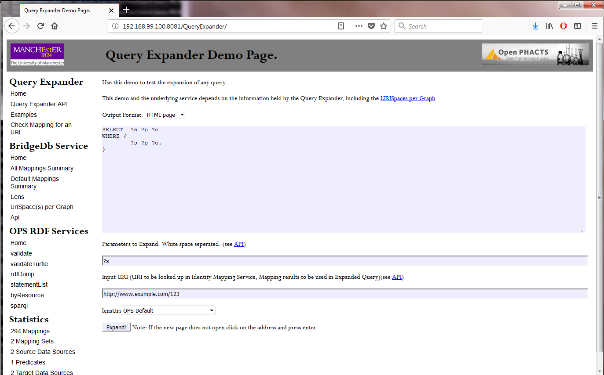

# Tutorial - How to install and load the Identifier Mapping Service with data needed for gene-to-variant and variant-to-gene

This tutorial explains how to install and run a BridgeDb Identifier Mapping Service (IMS)
with gene-to-variant and variant-to-gene functionality.

## Step 1. Downloading the gene-variant mappings
  
Download the linksets data you want to load into the IMS from
[http://bridgedb.org/data/gene_database/linkset/](http://bridgedb.org/data/gene_database/linkset/).
  
## Step 2. Install Docker

A prerequisite is a Docker installation. You can download Docker from various places and many GNU/Linux distributions
ship a version as part of their distribution. Other options include:
  
* Docker Community Edition: [https://www.docker.com/get-docker](https://www.docker.com/get-docker)
* Docker Toolbox for older Mac and Windows versions:
  [https://docs.docker.com/toolbox/overview/](https://docs.docker.com/toolbox/overview/)
* Docker for Windows: [https://docs.docker.com/docker-for-windows/](https://docs.docker.com/docker-for-windows/)
  
## Step 3. Downloading the BridgeDb IMS Docker
  
Pull the IMS docker image:

```shell
docker pull openphacts/identitymappingservice
```

## Step 4. Set up the MySQL service

Create the MySQL docker image to store the linksets, for MySQL 6 or higher:

```shell
docker run --name mysql-for-ims -e MYSQL_ALLOW_EMPTY_PASSWORD=yes \
           -e MYSQL_DATABASE=ims -e MYSQL_USER=ims -e MYSQL_PASSWORD=ims \
           -d mysql --default-authentication-plugin=mysql_native_password
```

For MySQL 5.5 or lower, use:

```shell
docker run --name mysql-for-ims -e MYSQL_ALLOW_EMPTY_PASSWORD=yes \
           -e MYSQL_DATABASE=ims -e MYSQL_USER=ims -e MYSQL_PASSWORD=ims \
           -d mysql:5.5
```


## Step 5. Loading the gene-gene and gene-variant link sets

The next command line example assumes that the file `load.xml` is present the `/home/johndoe/data5` directory.

Unix:
```shell
docker run --link mysql-for-ims:mysql -v /home/johndoe/data5:/staging \
           openphacts/identitymappingservice loader file:///staging/load.xml
```

MINGW64 / Windows:
```shell
docker run --link mysql-for-ims:mysql -v /c/Users/johndoe/data5:/staging openphacts/identitymappingservice loader file:///staging/load.xml
```

An example of the load.xml file (more info):

```xml
<?xml version="1.0"?>
<loadSteps>
  <clearAll/>
  <void>file://staging/Ensembl_SNP_dataset.void.ttl</void>
  <linkset>file:///staging/PolyPhen_91.ttl</linkset>
</loadSteps>
```

## Step 6. Run the IMS docker image

```shell
docker run --name ims --link mysql-for-ims:mysql -p 8081:8080 -d openphacts/identitymappingservice
```

You can confirm the instance is running with:

```shell
docker ps
```

Both these commands will give you a long identifier which you should remember for later.

## Step 7. Check the QueryExpander expose at the local port 8081

Open the following webpage in a browser:
* Unix: [http://localhost:8081/QueryExpander/](http://localhost:8081/QueryExpander/)
* Windows: [http://192.168.99.100:8081/QueryExpander/](http://192.168.99.100:8081/QueryExpander/)

It should look like this:



## Step 8. Shutting down the Docker image

Shutting down the docker is done with the command docker stop and the identifier you got with the docker run or docker ps commands, for example:

```shell
docker stop b5e9715818f6
```

of

```shell
docker stop ims
```

Where `b5e9715818f6` or `ims` happens to be the ID/name for the running image for the author at the time of writing.

You can delete the images with:

```shell
docker container rm b5e9715818f6 d989788c0b03
```

Where the two IDs are the one for the MySQL-IMS docker and the IMS docker containers.
